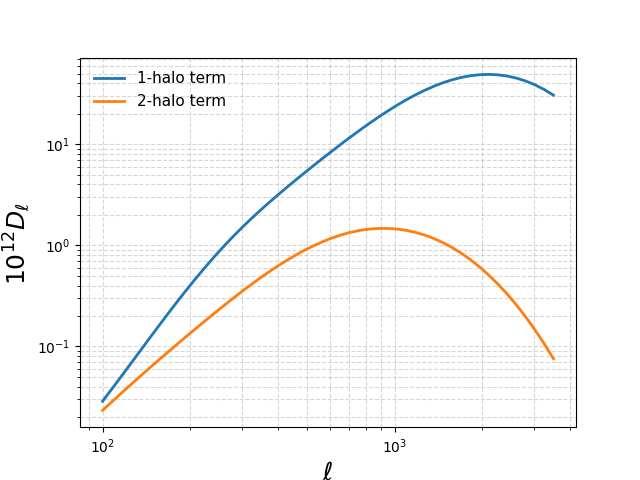
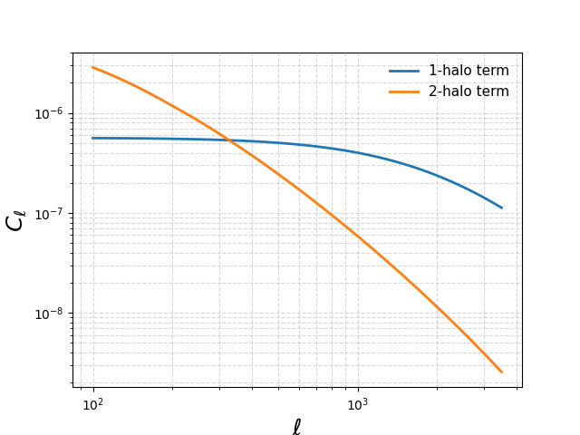

Computing angular power spectra
=====

Computing angular power spectra
-------------

Once you have successfully installed the package and relevant files such as emulators, you are ready to begin using the code. 

First, begin by setting your input parameters. A list of current `hmfast` parameters can be found below. 

.. code-block:: python

    import hmfast 
    import jax
    import jax.numpy as jnp
    import matplotlib.pyplot as plt

    params_hmfast = {

        # Emulator parameters. See https://github.com/cosmopower-organization for more details.
        'fEDE': 0.1,
        'log10z_c': 3.5,
        'thetai_scf': jnp.pi/2,
        'ln10^{10}A_s': 3.047, 
        'n_s': 0.965,
        'H0': 67.5,
        'omega_b': 0.02,
        'omega_cdm': 0.15,
        'r': 0.0,
        'm_ncdm': 0.06,
        'N_ur': 2.0308,
    
        # Other cosmological parameters
        'T_cmb': 2.7255,
        'deg_ncdm': 1,
        'B': 1.4,
        'delta': 200,      
    
        # tSZ power spectrum tracer-specific params using the gNFW pressure profile.
        'P0GNFW': 8.130,
        'gammaGNFW': 0.3292,
        'alphaGNFW': 1.0620,
        'betaGNFW': 5.4807,
        'c500': 1.156,
        
        # Galaxy HOD tracer-specific params. See https://arxiv.org/pdf/2203.12583 for more details.
        'sigma_log10M_HOD': 0.68,
        'alpha_s_HOD':    1.30,
        'M1_prime_HOD': 10**12.7, # msun/h
        'M_min_HOD': 10**11.8, # msun/h
        'M0_HOD' :0,
    }

Once your parameters have been initialised, you may now define your objects that will serve as building blocks for your code. 
We will include an example for the tSZ power spectrum and galaxy HOD.

.. code-block:: python

    # Load emulators from your data file
    emulator_path = "your/path/to/hmfast_data"
    emulator = hmfast.emulator_eval.Emulator(emulator_path, cosmo_model=0)
    
    # Define your halo model, which depends on your emulators and parameters
    halo_model = hmfast.halo_model.HaloModel(emulator, params=params_hmfast)
    
    # Define your tracers. These tracers evaluate the profile over a dimensionless radial grid x = r / r_scale (e.g. r500 or r_s)
    # You may either pass a custom x_grid, or you may omit the x_grid argument which will fall back to defaults. 
    x_grid_tsz = jnp.logspace(jnp.log10(1e-4), jnp.log10(20.0), 512)
    x_grid_hod = jnp.logspace(jnp.log10(1e-5), jnp.log10(50.0), 512)
    tsz_tracer = hmfast.tracers.tsz.TSZTracer(emulator, x_grid=x_grid_tsz, params=params_hmfast)
    galaxy_hod_tracer = hmfast.tracers.galaxy_hod.GalaxyHODTracer(emulator, halo_model, x_grid=x_grid_hod, params=params_hmfast)

Now, you're ready to compute the angular power spectrum. Let's begin with tSZ.

.. code-block:: python

    z_grid_tsz = jnp.geomspace(0.005, 3.0, 100)
    m_grid_tsz = jnp.geomspace(5e10, 3.5e15, 100)
    ell_grid_tsz = jnp.logspace(jnp.log10(2), jnp.log10(8e3), num=50)
    
    C_ell_yy_1h = halo_model.get_C_ell_1h(tsz_tracer, z_grid_tsz, m_grid_tsz, ell_grid_tsz, params=params_hmfast)
    C_ell_yy_2h = halo_model.get_C_ell_2h(tsz_tracer, z_grid_tsz, m_grid_tsz, ell_grid_tsz, params=params_hmfast)
    
    D_ell_yy_1h = ell_grid_tsz*(ell_grid_tsz+1)*C_ell_yy_1h/(2*jnp.pi)*1e12
    D_ell_yy_2h = ell_grid_tsz*(ell_grid_tsz+1)*C_ell_yy_2h/(2*jnp.pi)*1e12
     
    label_size = 17
    title_size = 18
    legend_size = 13
    handle_length = 1.5
    plt.loglog(ell_grid_tsz, D_ell_yy_1h, lw=2, label='1-halo term')
    plt.loglog(ell_grid_tsz, D_ell_yy_2h, lw=2, label='2-halo term')
    plt.grid(which='both', linestyle='--', alpha=0.5)
    plt.minorticks_on()
    plt.legend(fontsize=11,ncol=1,frameon=False)
    plt.xlabel(r"$\ell$ ",size=title_size)
    plt.ylabel(r"$10^{12} D_\ell$ ",size=title_size)
    plt.show()

Let's now also plot angular power spectrum for the galaxy HOD tracer.

.. code-block:: python
    z_grid_hod = jnp.geomspace(0.005, 3.0, 100)
    m_grid_hod = jnp.geomspace(5e10, 3.5e15, 100)
    ell_grid_hod = jnp.geomspace(1e2, 3.5e3, 50)
    
    C_ell_gg_1h = halo_model.get_C_ell_1h(galaxy_hod_tracer, z_grid_hod, m_grid_hod, ell_grid_hod, params=params_hmfast)
    C_ell_gg_2h = halo_model.get_C_ell_2h(galaxy_hod_tracer, z_grid_hod, m_grid_hod, ell_grid_hod, params=params_hmfast)
    
    label_size = 17
    title_size = 18
    legend_size = 13
    handle_length = 1.5
    plt.loglog(ell_grid_hod, C_ell_gg_1h, lw=2, label='1-halo term')
    plt.loglog(ell_grid_hod, C_ell_gg_2h, lw=2, label='2-halo term')
    plt.grid(which='both', linestyle='--', alpha=0.5)
    plt.minorticks_on()
    plt.legend(fontsize=11,ncol=1,frameon=False)
    plt.xlabel(r"$\ell$ ",size=title_size)
    plt.ylabel(r"$C_\ell$ ",size=title_size)
    plt.show()

    
    
    
